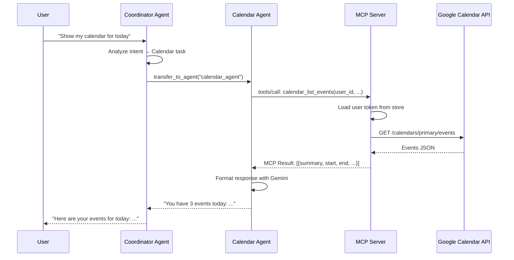
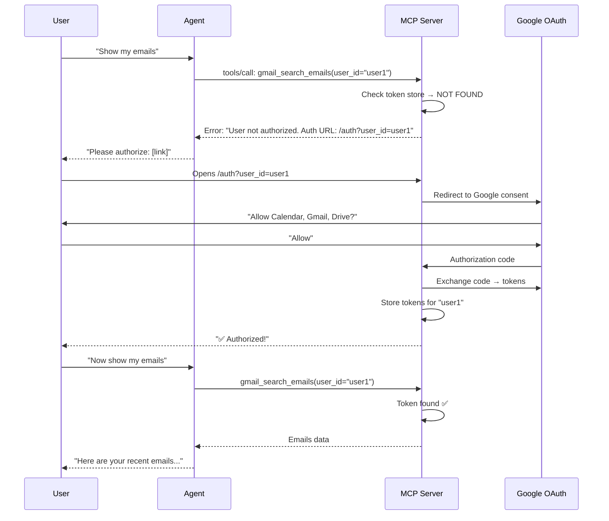

# 🤖 Personal AI Assistant — Google Workspace Edition

> An AI-powered personal assistant that manages your **Google Calendar**, **Gmail**, and **Google Drive** using multi-agent orchestration powered by **Google ADK** and the **Model Context Protocol (MCP)**.

---

## 🏗️ Architecture Overview

```
┌──────────────────────────────────────────────────────────────┐
│                         USER                                 │
│                    (Browser / Chat)                           │
└──────────────────────┬───────────────────────────────────────┘
                       │ HTTP / WebSocket
                       ▼
┌──────────────────────────────────────────────────────────────┐
│              personal-ai-assistant/                           │
│  ┌─────────────────────────────────────────────────────────┐ │
│  │              Coordinator Agent                          │ │
│  │         (Gemini 2.5 Flash — Orchestrator)               │ │
│  │  ┌──────────┐  ┌──────────┐  ┌──────────┐              │ │
│  │  │ Calendar  │  │  Gmail   │  │  Drive   │  ← Sub-Agents│ │
│  │  │  Agent    │  │  Agent   │  │  Agent   │              │ │
│  │  └────┬─────┘  └────┬─────┘  └────┬─────┘              │ │
│  └───────┼──────────────┼──────────────┼───────────────────┘ │
│          │              │              │                      │
│          └──────────────┼──────────────┘                      │
│                         │ MCP (Streamable HTTP)               │
└─────────────────────────┼────────────────────────────────────┘
                          ▼
┌──────────────────────────────────────────────────────────────┐
│              mcp-servers/google_workspace/                    │
│  ┌─────────────────────────────────────────────────────────┐ │
│  │          Google Workspace MCP Server                    │ │
│  │                                                         │ │
│  │  /mcp          → MCP Protocol (16 tools)                │ │
│  │  /auth         → OAuth Flow (per-user)                  │ │
│  │  /health       → Health Check                           │ │
│  │                                                         │ │
│  │  Token Store: Local (.tokens/) or Firestore             │ │
│  └─────────────────────┬───────────────────────────────────┘ │
│                         │ Google REST APIs                    │
└─────────────────────────┼────────────────────────────────────┘
                          ▼
          ┌───────────────────────────────┐
          │     Google Workspace APIs      │
          │  Calendar  │  Gmail  │  Drive  │
          └───────────────────────────────┘
```

---

## 📂 Project Structure

```
personal-assistant/
├── README.md                        ← You are here
├── index.html                       ← Interactive documentation
├── .gitignore
│
├── mcp-servers/                     ← MCP Servers (independent services)
│   └── google_workspace/
│       ├── server.py                ← Multi-user MCP server
│       ├── credentials.json         ← OAuth Client ID (your app)
│       ├── .tokens/                 ← Per-user OAuth tokens (dev)
│       ├── Dockerfile               ← Cloud Run deployment
│       ├── requirements.txt
│       ├── README.md                ← MCP server docs
│       ├── index.html               ← MCP server interactive docs
│       └── .venv/                   ← Python 3.12
│
├── personal-ai-assistant/           ← ADK Agent System
│   ├── app/
│   │   ├── agents/
│   │   │   ├── coordinator/         ← Orchestrator agent
│   │   │   └── calendar/            ← Calendar sub-agent
│   │   ├── utils/
│   │   │   └── mcp.py               ← MCP connection manager
│   │   ├── config.py                ← Agent model config
│   │   └── main.py                  ← FastAPI entry point
│   ├── mcp_settings.json            ← MCP server endpoints
│   ├── requirements.txt
│   ├── .env                         ← API keys
│   ├── README.md                    ← Agent system docs
│   ├── index.html                   ← Agent system interactive docs
│   └── .venv/                       ← Python 3.12
```

---

## 🔄 Request Flow

### Complete Sequence: "Show my calendar events"



### First-Time User Authorization



---

## 🛠️ Available MCP Tools (16 total)

### 🔐 Auth (2 tools)
| Tool | Description |
|------|-------------|
| `auth_check_status` | Check if user has authorized |
| `auth_revoke` | Revoke user's authorization |

### 📅 Calendar (6 tools)
| Tool | Description |
|------|-------------|
| `calendar_list_calendars` | List all calendars |
| `calendar_list_events` | List upcoming events |
| `calendar_create_event` | Create new event |
| `calendar_update_event` | Update existing event |
| `calendar_delete_event` | Delete an event |
| `calendar_check_availability` | Check free/busy status |

### 📧 Gmail (5 tools)
| Tool | Description |
|------|-------------|
| `gmail_search_emails` | Search emails |
| `gmail_read_email` | Read specific email |
| `gmail_send_email` | Send new email |
| `gmail_reply_to_email` | Reply to email thread |
| `gmail_list_labels` | List Gmail labels |

### 📁 Drive (3 tools)
| Tool | Description |
|------|-------------|
| `drive_list_files` | List files in Drive |
| `drive_search_files` | Search files by name |
| `drive_read_file` | Read file content |

---

## 🚀 Quick Start

### 1. Start the MCP Server
```bash
cd mcp-servers/google_workspace
source .venv/bin/activate
MCP_TRANSPORT=streamable-http python server.py
```

### 2. Start the AI Assistant
```bash
cd personal-ai-assistant
source .venv/bin/activate
python -m app.main
```

### 3. Authorize Your Account
Open in browser: `http://localhost:8080/auth?user_id=your-username`

---

## 🔒 Security Model

| Component | What it protects | How |
|-----------|-----------------|-----|
| **OAuth Client ID** | App identity | `credentials.json` — never committed |
| **Per-user tokens** | User data access | Stored in Firestore (prod) or local files (dev) |
| **Cloud Run IAM** | Server access | `--no-allow-unauthenticated` |
| **Consent Screen** | User consent | Google OAuth consent flow |

---

## 📦 Tech Stack

| Layer | Technology |
|-------|-----------|
| **AI Model** | Google Gemini 2.5 Flash |
| **Agent Framework** | Google ADK (Agent Development Kit) |
| **Tool Protocol** | MCP (Model Context Protocol) via Streamable HTTP |
| **MCP Server** | Python + FastMCP (official `mcp` SDK) |
| **APIs** | Google Calendar, Gmail, Drive (REST) |
| **Auth** | OAuth 2.0 (Web Application flow) |
| **Deployment** | Google Cloud Run |
| **Token Storage** | Firestore (prod) / Local JSON (dev) |
| **Python** | 3.12+ |

---

## 📋 Environment Variables

### MCP Server (`mcp-servers/google_workspace/`)
| Variable | Default | Description |
|----------|---------|-------------|
| `MCP_TRANSPORT` | `stdio` | Transport: `stdio`, `sse`, `streamable-http` |
| `PORT` | `8080` | Server port |
| `BASE_URL` | `http://localhost:8080` | Base URL for OAuth redirects |
| `TOKEN_BACKEND` | `local` | Token storage: `local` or `firestore` |
| `GCP_PROJECT` | `personal-ai-agent-492408` | GCP project for Firestore |

### AI Assistant (`personal-ai-assistant/`)
| Variable | Description |
|----------|-------------|
| `GOOGLE_API_KEY` | Gemini API key |

---

## 🏢 Deployment Architecture (Production)

```
┌─────────────────────────────────────┐
│           Google Cloud Run           │
│  ┌──────────────────────────────┐   │
│  │   MCP Server (Container)     │   │
│  │   - Streamable HTTP          │   │
│  │   - Firestore token store    │   │
│  │   - OAuth endpoints          │   │
│  └──────────────┬───────────────┘   │
│                 │                    │
│  ┌──────────────┴───────────────┐   │
│  │   AI Assistant (Container)   │   │
│  │   - Coordinator Agent        │   │
│  │   - Calendar/Gmail/Drive     │   │
│  │   - Gemini API               │   │
│  └──────────────────────────────┘   │
│                                      │
│  ┌──────────────────────────────┐   │
│  │   Firestore                  │   │
│  │   - mcp_user_tokens          │   │
│  └──────────────────────────────┘   │
└─────────────────────────────────────┘
```
