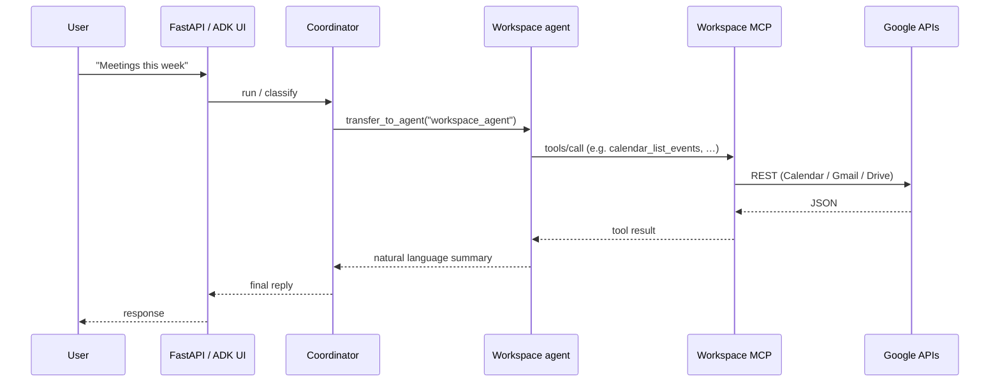

# Personal AI Assistant — Google Workspace (monorepo)

AI assistant that uses **Google ADK** with a **coordinator** and one **workspace** sub-agent. All Calendar, Gmail, and Drive actions go through a single **Google Workspace MCP** server (`mcp-servers/google_workspace/`).

---

## Architecture overview

```
┌─────────────────────────────────────────────────────────────────┐
│  USER (browser, curl, or ADK Web UI)                             │
└────────────────────────────┬────────────────────────────────────┘
                             │ HTTPS
                             ▼
┌─────────────────────────────────────────────────────────────────┐
│  personal-ai-assistant/                                          │
│  ┌───────────────────────────────────────────────────────────┐  │
│  │  Coordinator agent (no MCP tools)                          │  │
│  │  • Small talk, intent routing                               │  │
│  │  • transfer_to_agent → workspace_agent                      │  │
│  └────────────────────────────┬──────────────────────────────┘  │
│                               │                                   │
│  ┌────────────────────────────▼──────────────────────────────┐  │
│  │  Workspace agent (single specialist)                        │  │
│  │  • One MCPToolset: "google-workspace"                       │  │
│  │  • Uses Calendar / Gmail / Drive tools the MCP exposes    │  │
│  └────────────────────────────┬──────────────────────────────┘  │
└───────────────────────────────┼──────────────────────────────────┘
                                │ MCP (Streamable HTTP)
                                ▼
┌─────────────────────────────────────────────────────────────────┐
│  mcp-servers/google_workspace/                                   │
│  • /mcp     — MCP protocol                                       │
│  • /auth    — per-user OAuth                                     │
│  • Tools: calendar_*, gmail_*, drive_* (see server README)      │
└────────────────────────────┬────────────────────────────────────┘
                             │ Google APIs
                             ▼
                  Calendar · Gmail · Drive
```

There is **no separate ADK “calendar agent”**: the **workspace agent** holds the MCP toolset and calls whichever tool fits (e.g. `calendar_list_events`, `gmail_search_emails`, `drive_list_files`). Only **`personal-ai-assistant/app/agents/coordinator/`** is registered as an ADK app root for `adk web`; the workspace agent is a **sub-agent** loaded from `coordinator/workspace_agent.py`.

---

## Repository layout

```
personal-assistant/
├── README.md                    ← this file
├── .gitignore
├── .env.example                 ← hints for both apps (copy to per-app .env)
├── index.html                   ← optional landing / docs
│
├── mcp-servers/
│   └── google_workspace/        ← Workspace MCP (OAuth, tools, Cloud Run image)
│       ├── server.py
│       ├── Dockerfile
│       ├── README.md
│       └── …
│
└── personal-ai-assistant/       ← ADK app + FastAPI API
    ├── app/
    │   ├── agents/
    │   │   └── coordinator/     ← root_agent + workspace sub-agent
    │   ├── main.py              ← FastAPI: /api/chat, optional ADK Web UI
    │   └── …
    ├── mcp_settings.json        ← points at MCP base URL + /mcp
    ├── config.yaml              ← Gemini models (coordinator + workspace)
    ├── Dockerfile
    └── README.md                ← deeper agent / dev setup
```

---

## Request flow (example: “meetings this week”)



---

## MCP tools (exposed by `google_workspace` server)

The MCP server groups tools by product; the **workspace agent** can call any of them through the same connection.

| Area | Examples (names depend on server version) |
|------|-------------------------------------------|
| Auth | Status / revoke helpers |
| Calendar | `calendar_list_events`, `calendar_create_event`, … |
| Gmail | `gmail_search_emails`, `gmail_read_email`, … |
| Drive | `drive_list_files`, `drive_search_files`, … |

See **`mcp-servers/google_workspace/README.md`** and **`docs/tools_reference.md`** there for the authoritative list.

---

## Quick start (local)

### 1. Workspace MCP

```bash
cd mcp-servers/google_workspace
python -m venv .venv && source .venv/bin/activate
pip install -r requirements.txt
# Add credentials.json + .env (see that folder’s README)
MCP_TRANSPORT=streamable-http python server.py
```

Set **`BASE_URL`** (or rely on request host on Cloud Run) so OAuth links are not stuck on `http://localhost:8080` in production.

### 2. Assistant

```bash
cd personal-ai-assistant
./scripts/bootstrap_venv.sh   # or uv sync --python 3.12
source .venv/bin/activate
# Point mcp_settings.json "url" at http://localhost:8080/mcp (or your deployed MCP)
python -m app.main
```

- **REST:** `POST /api/chat`, `GET /api/health`  
- **ADK Web UI:** set `ENABLE_ADK_WEB_UI=true` (see `personal-ai-assistant/README.md` and `Dockerfile`).

### 3. OAuth (first time)

Open the MCP server’s auth URL (often `/auth?user_id=…`) using the **public base URL** of the MCP service, not localhost, when deployed.

---

## Environment variables (summary)

| Where | Important vars |
|-------|----------------|
| **MCP** (`mcp-servers/google_workspace/`) | `MCP_TRANSPORT`, `PORT`, `BASE_URL`, `TOKEN_BACKEND`, `GCP_PROJECT`, `GOOGLE_OAUTH_CREDENTIALS` |
| **Assistant** (`personal-ai-assistant/`) | `GOOGLE_API_KEY` and/or Vertex (`GOOGLE_GENAI_USE_VERTEXAI`, `GOOGLE_CLOUD_PROJECT`, `GOOGLE_CLOUD_LOCATION`), `ENABLE_ADK_WEB_UI`, `ASSISTANT_TIMEZONE` |

Root **`.env.example`** lists placeholders; each app typically uses its **own** `.env` file (gitignored).

---

## Deployment (typical)

Two **Cloud Run** services are common:

1. **Workspace MCP** — public HTTPS URL; set `BASE_URL` to that URL; register the same redirect URI in Google OAuth client settings.  
2. **Assistant** — build from `personal-ai-assistant/`; set `mcp_settings.json` (or build-time config) to `https://<mcp-service>/mcp`.

See `personal-ai-assistant/scripts/deploy_cloud_run_minimal.sh` and `mcp-servers/google_workspace/docs/deployment_guide.md`.

---

## Security

| Asset | Notes |
|-------|--------|
| OAuth client / secrets | `credentials.json`, `client_secret*.json`, `.tokens/` — **never commit** (covered by root `.gitignore`) |
| User tokens | Local files or Firestore in production |
| API keys | `GOOGLE_API_KEY` via Secret Manager on Cloud Run |

---

## Tech stack

| Layer | Technology |
|-------|------------|
| LLM | Google Gemini — see **Gemini models** below (`personal-ai-assistant/config.yaml`) |
| Agents | Google ADK — coordinator + `workspace_agent` |
| Tools | MCP Streamable HTTP → `mcp-servers/google_workspace` |
| Assistant HTTP | FastAPI, optional ADK Web UI |
| Python | 3.12 recommended for `personal-ai-assistant` (see `.python-version`) |

### Gemini models (`personal-ai-assistant/config.yaml`)

- **Per agent:** `agents.coordinator` and `agents.workspace` each have their own block. You can assign different model chains for routing vs. tool-heavy workspace turns; the repo default uses the **same** ordered `model_candidates` for both.
- **Primary model:** The **first** ID in `model_candidates` is the main model for generation.
- **Fallback chain:** Additional list entries are **fallbacks in order**. On **quota / rate-limit** style failures (for example HTTP **429** or **RESOURCE_EXHAUSTED**), the same request is retried with the **next** model via `FallbackGeminiLlm` — no agent code changes. See [`personal-ai-assistant/docs/model-fallback.md`](personal-ai-assistant/docs/model-fallback.md).
- **Single model:** One entry in `model_candidates` (or a plain `model:` field) skips the fallback wrapper and passes a string model name straight to ADK.

Current default order (edit the file to change IDs):

```yaml
# excerpt — see full file in-repo
agents:
  workspace:
    model_candidates:
      - gemini-3.1-flash-lite-preview   # primary
      - gemini-3-flash-preview          # fallback 1
      - gemini-2.5-flash                # fallback 2
  coordinator:
    model_candidates:
      - gemini-3.1-flash-lite-preview
      - gemini-3-flash-preview
      - gemini-2.5-flash
```

---

## More detail

- **Agent code, `adk web`, uv, Cloud Run flags:** [`personal-ai-assistant/README.md`](personal-ai-assistant/README.md)  
- **MCP server, tools, OAuth, Firestore:** [`mcp-servers/google_workspace/README.md`](mcp-servers/google_workspace/README.md)
