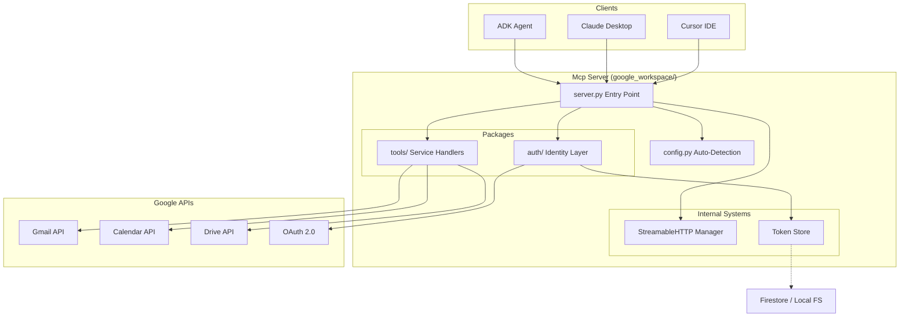

# 🏗️ Design Document: Google Workspace MCP Server

This document outlines the architecture and design principles of the **Google Workspace MCP Server**, a multi-user, production-ready implementation of the Model Context Protocol.

---

## 🗺️ System Architecture

The server is built using a modular, transport-agnostic architecture. It leverages **FastMCP** for tool definition and **Starlette** for high-performance ASGI hosting.

### Component Diagram

---

## 📁 Modular Structure

To ensure maintainability, the codebase is split into specific, logic-driven packages:

| Component | Responsibility |
| :--- | :--- |
| **`server.py`** | Application lifecycle, transport selection, and module registration. |
| **`config.py`** | Environment variable management and **Dynamic URL Detection**. |
| **`auth/`** | Handles per-user OAuth tokens, Google credentials, and Starlette auth routes. |
| **`tools/`** | Domain-specific handlers for Google Calendar, Gmail, and Google Drive. |

---

## 🔄 Data & Execution Flow

### 1. Registration
At startup, `server.py` initializes the `FastMCP` instance and calls `register(mcp)` on every tool module. This attaches the tools to the MCP server.

### 2. Request Handling
1.  A Client sends a `tools/call` request over the chosen transport (stdio, SSE, or Streamable HTTP).
2.  The server identifies the target tool function.
3.  The tool function calls `auth.helpers.get_credentials(user_id)`.
4.  The Auth layer retrieves the stored token, **automatically refreshes it if expired**, and builds the authorized Google service object.
5.  The tool executes the request against Google APIs and returns a standard MCP result.

---

## 🛡️ Key Desgin Principles

> [!IMPORTANT]
> **User Isolation**: All operations require a `user_id`. Tokens are scoped strictly to the user ID provided by the client.

> [!TIP]
> **Transport Agnostic**: The server supports `stdio` for local usage and `Streamable HTTP` for production/agentic usage without changing any business logic.

> [!NOTE]
> **Zero Configuration Deployment**: Using `config.py`, the server automatically detects its own base URL from incoming request headers, eliminating the need to hardcode callback URLs.
