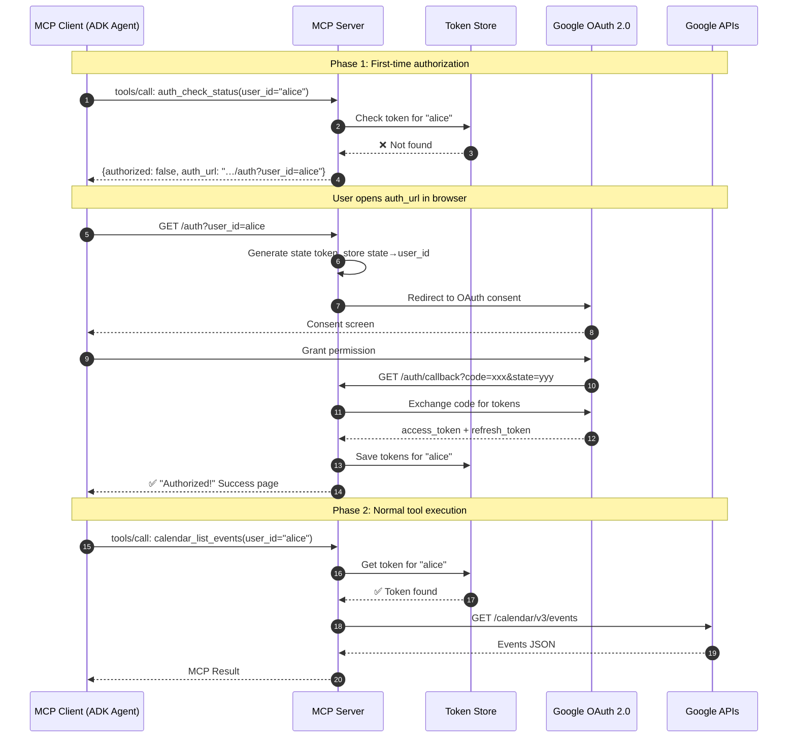

# 🔐 Multi-User Authentication & Lifecycle

This document explains how the **Google Workspace MCP Server** manages identity and security across multiple independent users.

---

## 🛠️ Authentication Flow

The server uses a **Web Application** OAuth 2.0 flow, which is fully automated via the following sequence.

### OAuth Sequence Diagram

---

## 💾 Token Storage Backends

The application supports two persistent storage engines, toggleable via environment variables.

### 1. Local (Development)
- **Folder**: `mcp-servers/google_workspace/.tokens/`
- **Format**: `.json` files named after the `user_id`.
- **Activation**: Set `TOKEN_BACKEND=local`.

### 2. Firestore (Production)
- **Collection**: `mcp_user_tokens`
- **Project**: Target Google Cloud Project ID.
- **Activation**: Set `TOKEN_BACKEND=firestore`.
- **Benefits**: Scalable, high-availability, handles per-user identity securely.

---

## ⚙️ URL Auto-Detection

> [!IMPORTANT]
> **Zero Configuration Required**: The server detects its own base URL from the `Host` and `X-Forwarded-Proto` headers (provided by Cloud Run). 

This means you don't need to manually configure `BASE_URL` when you deploy — the server automatically knows to use the correct callback URL (e.g. `https://my-mcp-abc123.run.app/auth/callback`).

---

## 🔒 Security & User Isolation

> [!WARNING]
> Every tool call **must** include a `user_id` parameter. The server uses this ID to fetch the corresponding user's tokens. 

### Why this is secure:
1.  **Strict Partitioning**: User `A` cannot call tools using User `B`'s tokens because the `TokenStore` isolates data by key.
2.  **Consent Prompt**: The OAuth flow uses `prompt="consent"` and `access_type="offline"` to ensure we receive a **refresh token**, allowing for background agent tasks without re-prompting.
3.  **Encrypted Metadata**: Token metadata (client ID, client secret) is retrieved only from the server-side `credentials.json`, never exposed to the client.
