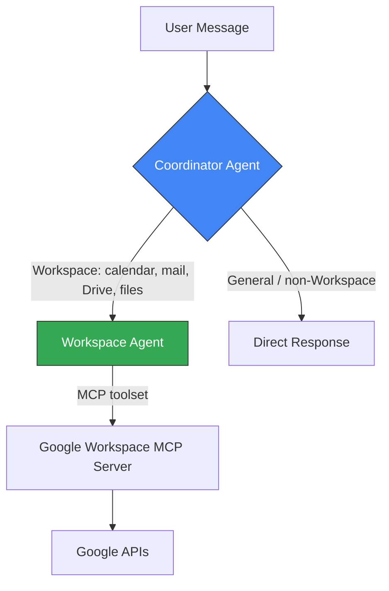
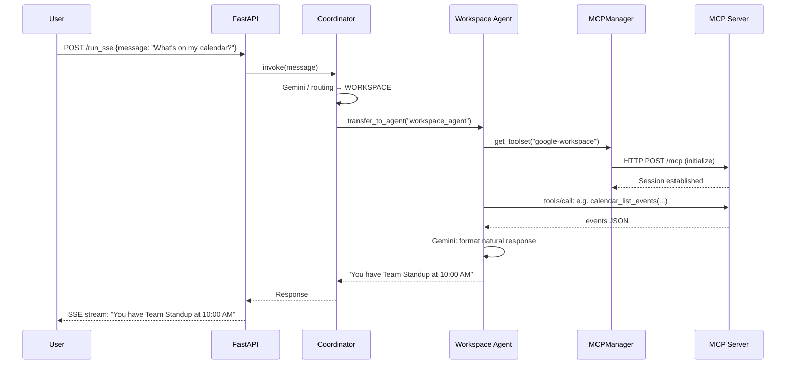

# 🤖 Personal AI Assistant — Agent System

> Multi-agent orchestration system built with **Google ADK** (Agent Development Kit) and **Gemini 2.5 Flash**. Manages Google Workspace tasks through intelligent agent delegation.

---

## 🏗️ Agent Architecture

```
┌──────────────────────────────────────────────────────────────┐
│                      ADK Agent System                         │
│                                                               │
│  ┌──────────────────────────────────────────────────────┐    │
│  │              🎯 Coordinator Agent                     │    │
│  │              (Gemini; see config.yaml)                 │    │
│  │                                                       │    │
│  │  Role: Chit-chat + route Workspace requests           │    │
│  │        (no MCP tools on this agent)                   │    │
│  └───────────────────────┬───────────────────────────────┘    │
│                          │ transfer_to_agent                 │
│                  ┌───────▼────────┐                          │
│                  │ 🗂️ Workspace   │                          │
│                  │    Agent       │                          │
│                  │ Calendar ·     │                          │
│                  │ Gmail · Drive  │                          │
│                  └───────┬────────┘                          │
│                          │                                   │
│            MCP Protocol (Streamable HTTP)                     │
│                          │                                   │
└──────────────────────────┼───────────────────────────────────┘
                           │
                           ▼
              ┌──────────────────────┐
              │  Google Workspace    │
              │    MCP Server        │
              │  (localhost:8080)     │
              └──────────────────────┘
```

---

## 🔄 Agent Delegation Flow



---

## 📄 Key Files

### `app/agents/coordinator/agent.py`
Orchestrator: answers light chit-chat and delegates Google Workspace work via `transfer_to_agent("workspace_agent")`. A `before_model_callback` can inject the same handoff when the coordinator model skips the tool.

### `app/agents/coordinator/workspace_agent.py`
Workspace sub-agent (MCP **`google-workspace`**) — not a separate ADK app; only the **coordinator** folder is registered under `app/agents/` for `adk web`.

### `app/utils/mcp.py`
MCP connection manager — handles transport configuration and toolset initialization.

### `app/config.py`
Singleton configuration manager for agent model settings.

### `mcp_settings.json`
```json
{
  "mcpServers": {
    "google-workspace": {
      "transport": "streamable_http",
      "url": "http://localhost:8080/mcp"
    }
  }
}
```

---

## 🔄 Request Lifecycle



---

## 🐍 Python version & dependencies

This repo targets **Python 3.12** only (see `.python-version`). Dependencies are declared in **`pyproject.toml`**, locked in **`uv.lock`**, and installed with **[uv](https://docs.astral.sh/uv/)** so `adk`, `mcp`, and `anyio` stay aligned. Avoid a global Homebrew `adk` on another Python unless it matches this stack.

**Install uv (once on your machine):** follow [Installing uv](https://docs.astral.sh/uv/getting-started/installation/) (e.g. `curl -LsSf https://astral.sh/uv/install.sh | sh`).

**Create the venv (from repo root):**

```bash
chmod +x scripts/bootstrap_venv.sh
./scripts/bootstrap_venv.sh   # uses `uv sync --python 3.12` when uv is available
```

**Or, without the script:**

```bash
uv sync --python 3.12
source .venv/bin/activate
```

**After changing dependencies in `pyproject.toml`:**

```bash
uv lock --python 3.12
uv sync
# optional: refresh pip-style export for environments without uv
uv export --format requirements-txt --no-hashes -o requirements.txt
```

**Check you are on 3.12 inside the venv:**

```bash
source .venv/bin/activate
python --version   # Python 3.12.x
which adk          # .../personal-ai-assistant/.venv/bin/adk
```

---

## 🚀 Running

```bash
# 1. Activate venv (required)
source .venv/bin/activate

# 2. Start the ADK dev server (uses venv Python 3.12).
#    Point at app/agents (only the coordinator/ package is an ADK app root):
adk web app/agents

# Or one shot (activates .venv and runs `adk web … app/agents`):
./scripts/adk_web.sh

# Override agent root if needed:
# ADK_AGENTS_DIR=/path/to/agents ./scripts/adk_web.sh

# 3. Or start with FastAPI
python -m app.main

# 4. Or use ADK CLI
adk run app/agents/coordinator
```

---

## ⚙️ Environment Variables

| Variable | Description |
|----------|-------------|
| `GOOGLE_API_KEY` | Gemini API key for LLM inference |
| `ASSISTANT_TIMEZONE` | IANA tz for **today** / calendar windows (e.g. `Asia/Kolkata`). Default `UTC`. Injected via global clock context so the model does not guess the date. |

---

## 📦 Dependencies

Declared in **`pyproject.toml`**; resolved versions are in **`uv.lock`**. The checked-in **`requirements.txt`** is an export for rare pip-only setups (`scripts/bootstrap_venv.sh` uses it when `uv` is missing).

| Package | Purpose |
|---------|---------|
| `google-adk` | Google Agent Development Kit |
| `mcp` | Model Context Protocol SDK |
| `fastapi` | HTTP server for agent endpoints |
| `uvicorn` | ASGI server |
| `pydantic` | Data validation |
| `python-dotenv` | Environment variable loading |
| `PyYAML` | Configuration files |
| `rich` | Terminal formatting |
| `uv` | Fast installer / lockfile (dev tool, not a Python import) |

---

## ☁️ Cloud Run Deployment FAQ

### 1. I get a `500 Internal Server Error` from `/api/chat` instead of `503`
A `500` error means the ADK Runner successfully started, but something failed internally during invocation. 
**Common causes:**
- The Model Context Protocol (MCP) server is timing out or refusing connection (401/403). Make sure the `url` in `mcp_settings.json` is correctly pointing to your accessible Cloud Run MCP instance. 
- You are missing the correct Environment variables for `google-genai` (e.g., `GOOGLE_API_KEY` incorrectly set or `GOOGLE_GENAI_USE_VERTEXAI` conflict). 
- **Verify:** Use `curl -s "https://YOUR-SERVICE.run.app/api/health"`. If `agent_ready` is true, check the Cloud Run logs for the full Python traceback on the `Chat invocation failed` line.

### 2. The Workspace Agent gives me an OAuth link pointing to `http://localhost:8080/auth` instead of my Cloud Run domain
The `google-workspace-mcp` service automatically detects its `BASE_URL` from incoming HTTP request headers (like `Host` and `X-Forwarded-Proto`). However, because the AI Assistant communicates with it via the `streamable_http` MCP tunnel instead of a standard browser request, the Host header isn't parsed identically, causing the OAuth generation to fall back to `localhost`.
**Fix:** Explicitly set the `BASE_URL` environment variable on your *Workspace MCP* Cloud Run service to its public URL:
```bash
gcloud run services update google-workspace-mcp \
  --project <your-project-id> \
  --region asia-south1 \
  --update-env-vars BASE_URL=https://google-workspace-mcp-...run.app
```

### 3. How do I enable the ADK Web UI on Cloud Run?
Set the `ENABLE_ADK_WEB_UI=true` environment variable when deploying. This mounts the pre-built Angular assets alongside the REST `/api/...` endpoints, allowing you to seamlessly interact with your Assistant from any browser.

### 4. "Failed to get tools from MCP server: Session terminated" Error
If you redeploy or restart the `google-workspace-mcp` service *after* the `personal-ai-assistant` is already running, you may see this error.
Because the `streamable_http` MCP protocol keeps session state entirely in memory on the server, the newly deployed `google-workspace-mcp` instance has no knowledge of the old session ID held by the Assistant. When the Assistant attempts to fetch tools or send data to that old session, the new MCP server returns `404 Not Found`, terminating the connection.
**Fix:** Forcefully restart the `personal-ai-assistant` service so it builds a fresh TCP handshake and requests a new session ID from the newly deployed MCP server:
```bash
gcloud run services update personal-ai-assistant \
  --project <your-project-id> \
  --region asia-south1 \
  --update-env-vars FORCE_RESTART=$(date +%s)
```
