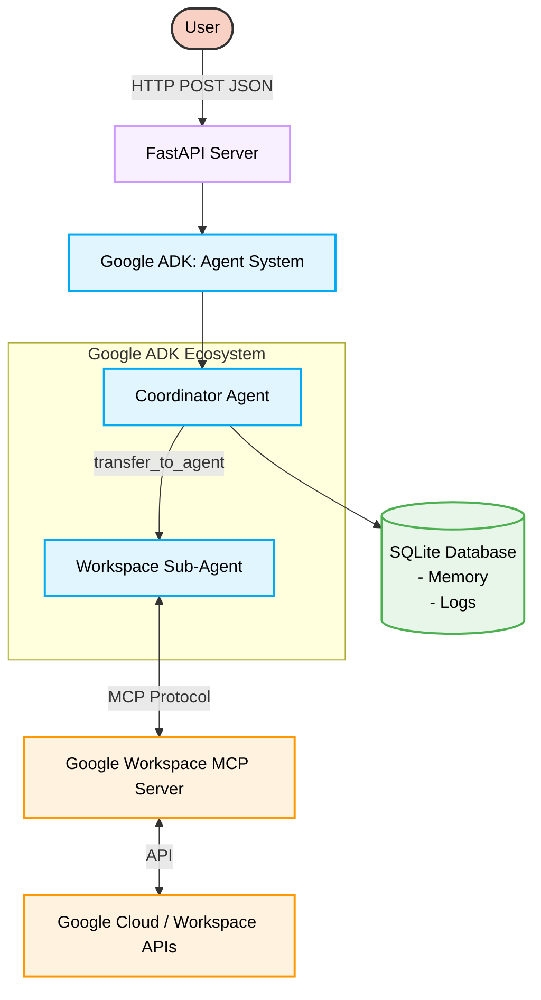
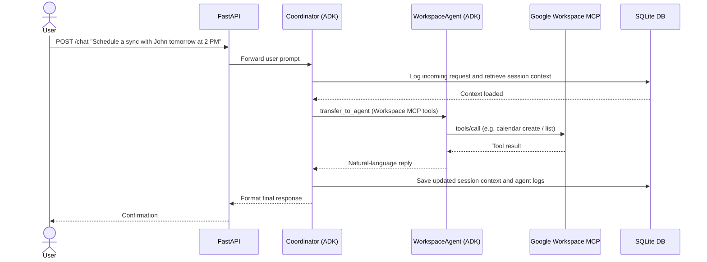
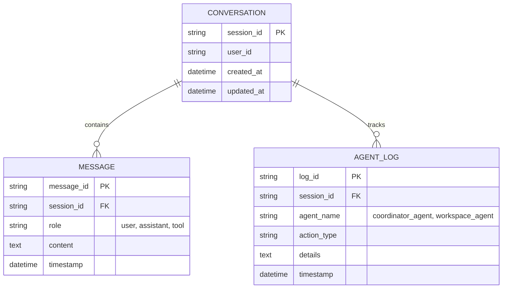

# System Design & Architecture

This document outlines the core architecture and workflow of the multi-agent AI system built using the **Google Agent Development Kit (ADK)**. 

## 1. High-Level Architecture

The system utilizes an API-based architecture where users interact with a primary coordinator agent that dynamically assigns sub-tasks to specialized agents.

## 2. Multi-Agent Workflow Example

This workflow illustrates a Workspace-oriented request (e.g. scheduling on Calendar via MCP):

## 3. SQLite Database Schema

We use a simple SQLite database to satisfy the requirement for persistent structured data. 

## 4. Why Google ADK?
Using `google-adk` (instead of just passing raw prompts to `google-genai`) provides:
1. **First-class Agent Abstractions:** Built-in `Agent` classes that make tool calling and multi-agent delegation seamless.
2. **Declarative & Imperative Definitions:** Ability to define agents in YAML or Python configurations.
3. **MCP Support:** Easily bind external Model Context Protocol servers to specific agents (like exposing Google Workspace only to the workspace agent).
